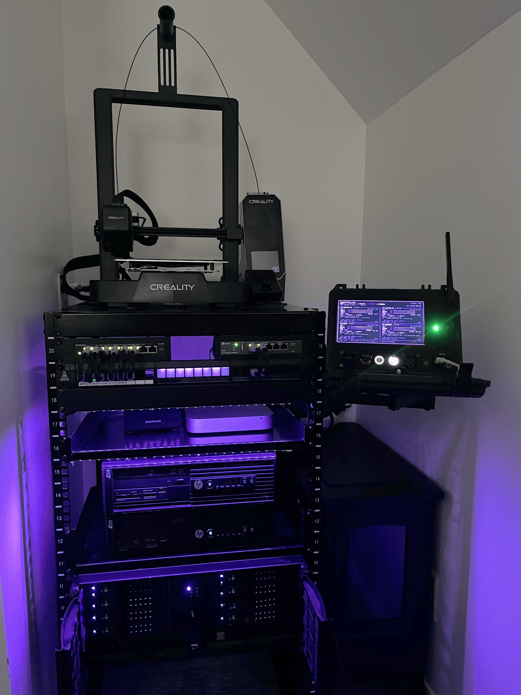

# UST-NET
This is my public-facing, sanitized homelab documentation. This repository documents my architecture, project progress, technical decisions, and evolving understanding of core concepts in a clear and approachable way. Currently still in work in progress, I've gone through huge migration and infrastructure changes which still need time to be reflected here. Thanks for stopping by friend :)

<p align="left">
  
</p>

## Infrastructure Overview

| Host | Role | VLAN | Primary Purpose |
|---|---|---:|---|
| `ust-overseer` | Management | VLAN 1 | Tailscale, management services, reverse proxy |
| `ust-axiom` | Production | VLAN 20 | NAS, Docker Services, Media, AI workloads |
| `ust-vault` | Backup | TBD | Backup server |
| `ust-sentinel-01` | Lab / Compute | VLAN 30 | Proxmox node |
| `ust-sentinel-02` | Lab / Compute | VLAN 30 | Proxmox node |

See [`docs/architecture/overview.md`](docs/architecture/overview.md) for the full design.

---

## Repository Structure

```text
.
├── README.md
├── CHANGELOG.md
├── NAMING.md
├── docs/
│   ├── architecture/
│   ├── hosts/
│   ├── network/
│   ├── services/
│   ├── runbooks/
│   └── decisions/
└── config-examples/
    ├── docker/
```

---

## Quick Links

- [Architecture](docs/architecture/overview.md)
- [Network Overview](docs/network/topology.md)
- [Naming Standard](NAMING.md)
