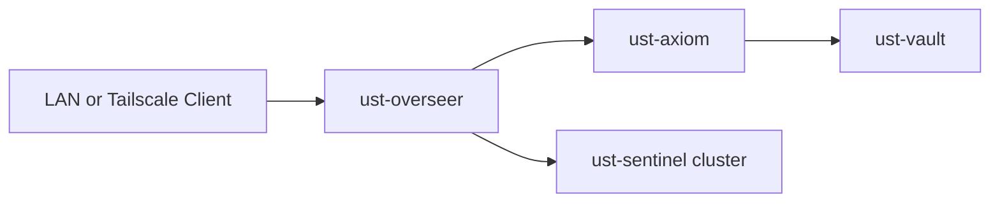

# Architecture Overview

UST-NET separates management, production, backup, and lab workloads so each environment can be maintained independently.

## Core Systems

| System | Responsibility |
| --- | --- |
| `ust-overseer` | DNS, reverse proxy, Tailscale, Prometheus, Grafana, and management tools |
| `ust-axiom` | Production containers, ZFS storage, media services, and AI workloads |
| `ust-vault` | Backup storage and recovery for critical data |
| `ust-sentinel-01/02` | Proxmox compute cluster for virtual machines and containers |

## Service Flow

Client requests resolve through internal DNS and reach Nginx on `ust-overseer`. Nginx forwards each request to the appropriate backend service. Prometheus collects host metrics and Grafana displays them.

## Design Goals

- Keep production workloads separate from the lab cluster.
- Use stable DNS names instead of exposing backend addresses.
- Centralize administration and monitoring on `ust-overseer`.
- Store production data on ZFS and maintain separate backups.
- Keep services private through VLAN segmentation and Tailscale.

