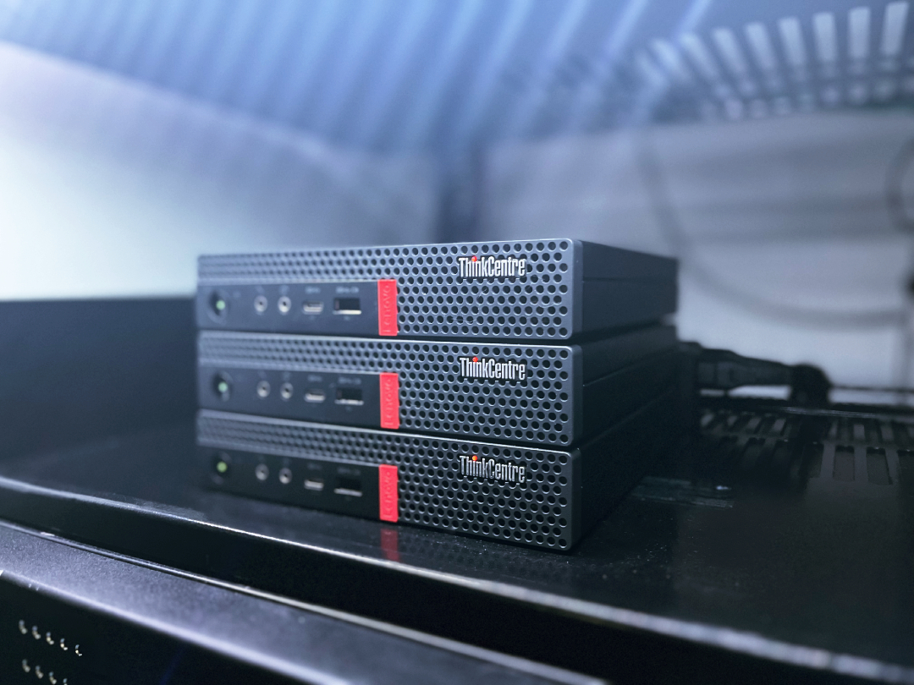

# ust-sentinel

  

## Overview

The `ust-sentinel` cluster consists of three Proxmox VE nodes used for lab and compute workloads.

## Nodes

| Host | Address | Network |
| --- | --- | --- |
| `ust-sentinel-01` | `192.168.30.100` | VLAN 30 |
| `ust-sentinel-02` | `192.168.30.101` | VLAN 30 |
| `ust-sentinel-03` | `192.168.30.102` | VLAN 30 |

## Hardware

All Sentinel nodes share the same hardware configuration.

| Property | Value |
| --- | --- |
| Role | Lab / Compute |
| Hardware | Lenovo ThinkCentre M75Q Gen 1 |
| CPU | Ryzen 5 3400GE |
| Memory | 16 GB |
| Hypervisor | Proxmox VE 9.2.2 |