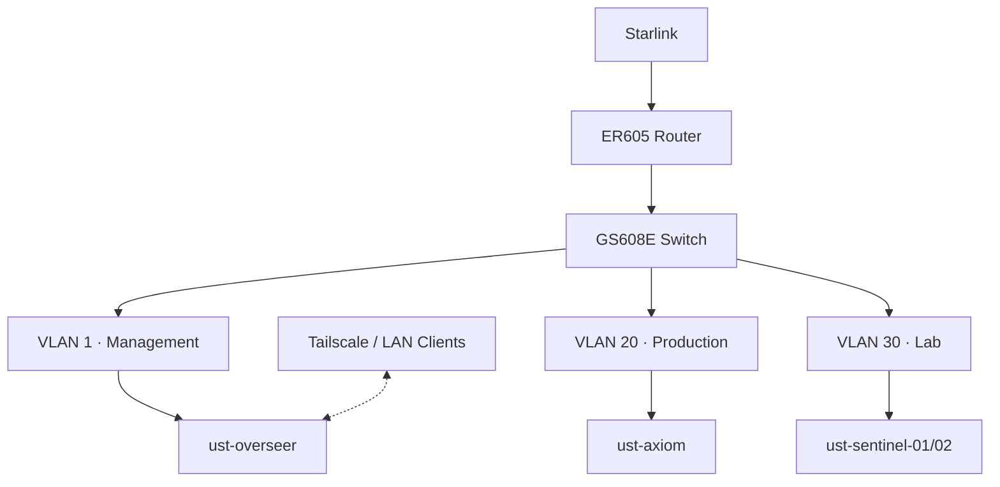

# Network Topology

## Overview

## Subnets

| Network | VLAN | Subnet | Purpose |
| --- | --- | --- | --- |
| Management | 1 | `192.168.10.0/24` | Infrastructure administration |
| Production | 20 | `192.168.20.0/24` | Stable services and storage |
| Lab | 30 | `192.168.30.0/24` | Proxmox and test workloads |

## Key Addresses

| Host | Address |
| --- | --- |
| `ust-overseer` | `192.168.10.100` |
| `ust-axiom` | `192.168.20.108` |
| `ust-sentinel-01` | `192.168.30.100` |
| `ust-sentinel-02` | `192.168.30.101` |

